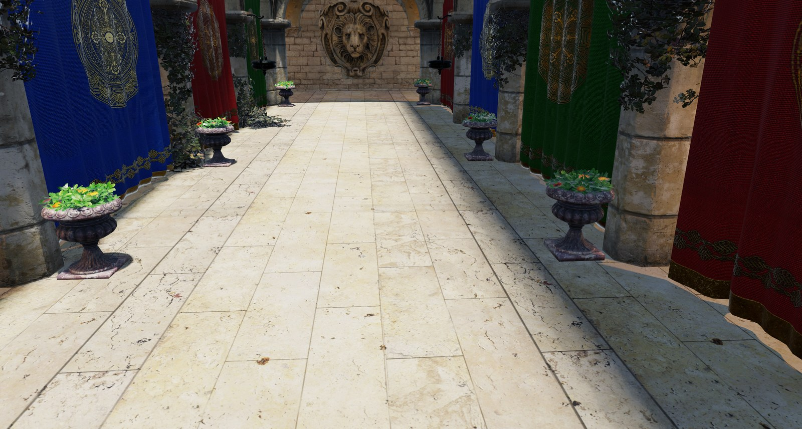
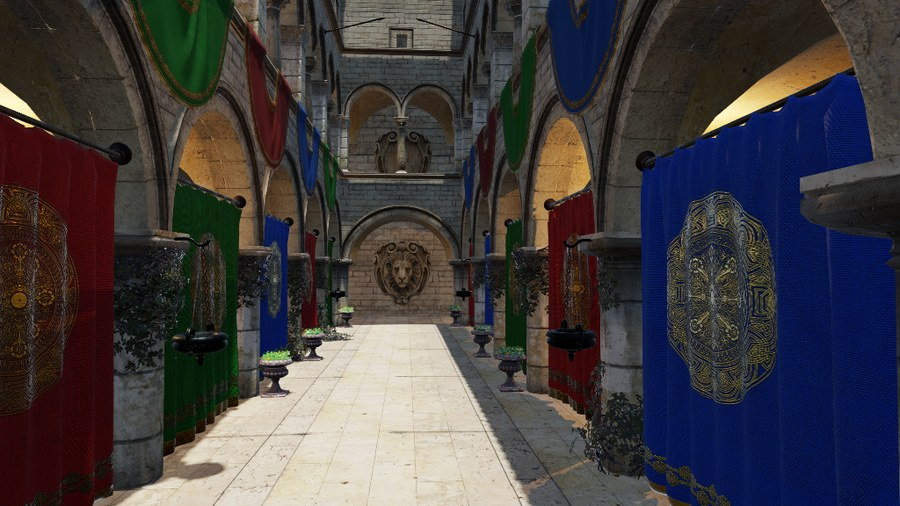
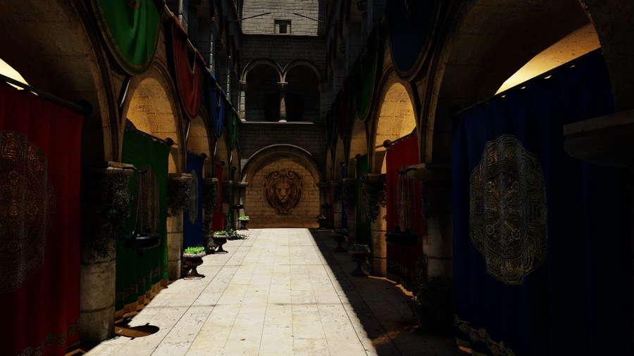
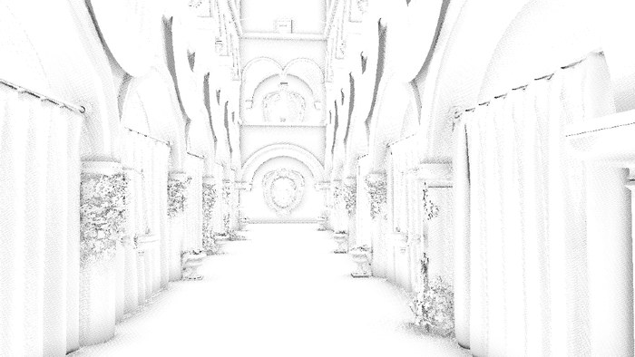
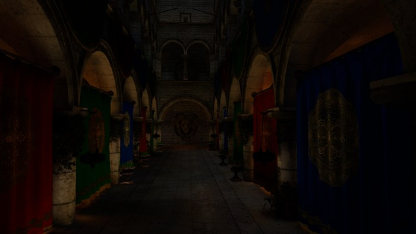
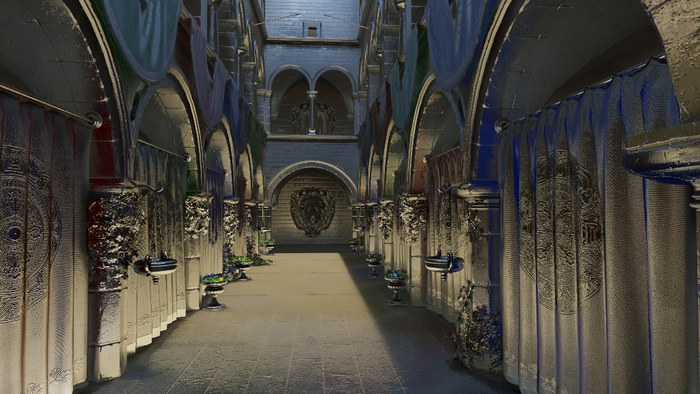
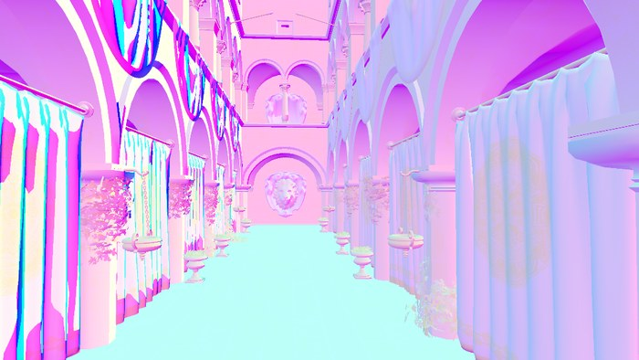

# Snowstorm Engine

[](https://github.com/MegatronJeremy/Snowstorm-Engine/actions/workflows/build.yml)



A 3D engine built around a **hybrid renderer**: a rasterized forward pass with shadows, ambient
occlusion, reflections and global illumination added as inline Vulkan ray queries, reconstructed from
one or two samples per pixel by an SVGF denoiser. Written in C++20 against a backend-agnostic
renderer interface, with an EnTT entity-component system and a Dear ImGui editor.

Windows and Vulkan. Public domain.

## Rasterization against ray tracing

The same frame, same camera, same exposure. On the left the forward pass alone, where a constant
ambient term stands in for everything light does after its first bounce. On the right the same pass
with the four ray-traced effects enabled and denoised.

| Rasterized | Ray traced |
| --- | --- |
|  |  |

The left image is the brighter of the two, which is the point: its ambient lifts every surface
equally whether or not light could reach it, so the vaults and the recesses behind the columns are as
bright as the open floor. On the right that fill is replaced by light that actually travelled.

Enabling all four effects costs 8.62 ms per frame on a Radeon RX 9070 XT and 6.01 ms on a GeForce RTX
5070, measured at 1915x1064 against a converged path trace of the same scene.

## Looking inside a frame

Every intermediate buffer is inspectable live from the editor through the `render.debugview` console
variable, which is how the renderer gets debugged and how the figures above were produced.

| Ambient occlusion | Global illumination |
| --- | --- |
|  |  |
| **Reflections** | **G-buffer normals** |
|  |  |

## What is in it

**Renderer.** Backend-agnostic interfaces (`Renderer`, `Pipeline`, `Shader`, `Material`,
`RenderGraph`) over a Vulkan 1.3 backend on volk, Vulkan Memory Allocator and SPIR-V reflection. The
render graph derives its own barriers from resource reads and writes rather than having them placed
by hand. Bindless textures, a dedicated transfer queue, per-pass GPU timestamps, and an HDR target
through ACES tonemapping.

**Hybrid ray tracing.** TLAS and BLAS driving shadows, ambient occlusion, reflections and diffuse
global illumination through `VK_KHR_ray_query`, so each effect drops into an ordinary compute or
fragment pass instead of requiring a ray-tracing pipeline and its binding table. One hit-shading
routine resolves any mesh in the scene through a bindless geometry table. Falls back to raster and
analytic baselines where the extension is missing.

**Reconstruction.** One SVGF implementation (temporal accumulation with variance estimation, then a
variance-guided à-trous filter) shared by every signal that needs it, over half-resolution traces
with a depth-aware bilateral upsample. Temporal anti-aliasing with camera jitter, a velocity pass and
a post-tonemap contrast-adaptive sharpen.

**Neural super-resolution.** Spatial and temporal CNN refiners as Vulkan compute passes in fp16 or
fp32 over an internal-resolution render, with a PyTorch harness in `Tools/neural/` exporting
byte-parity `.ssnn` weights.

**Entity-component system.** EnTT-backed, split into phased Systems, Singletons and Services, with
RTTR component reflection, native C++ scripting, and an opt-in data-parallel path
(`ParallelForEach`, `ParallelGather`) over the job system that preserves bit-identical output.

**Editor.** ImGui dockspace with scene hierarchy, inspector, ImGuizmo gizmos, click-to-select,
content browser, undo and redo, a performance panel showing per-system CPU and per-pass GPU time, a
live console-variable panel, and a developer console.

**Assets and scenes.** `.ssproj` projects, meshes and textures cooked to binary caches and loaded off
the main thread, JSON scene serialization, and HLSL compiled to SPIR-V through `dxc` asynchronously,
cached and hot-reloaded.

**Measurement.** The renderer is built to be measured rather than eyeballed: a golden-file GPU
benchmark that reports medians and quartile intervals over repeated runs, an image-quality gate
against a converged path trace using FLIP, PSNR and SSIM, a gate for quality under camera motion, and
a static shader occupancy gate. Each refuses to report a pass when it could not actually compare
anything.

## Running it

```
py Scripts/Generate-Solution.py
```

That bootstraps vcpkg, installs every dependency and writes `build/Snowstorm.sln`. Open it and build;
**Snowstorm-Editor** is the startup project. The first run is slow because vcpkg compiles the
dependencies from source. Requires Windows, Visual Studio 2022 and a Vulkan-capable GPU; no Vulkan
SDK installation is needed, since the loader, headers and validation layers all come from vcpkg.

| Target | Output | |
| --- | --- | --- |
| Snowstorm-Core | static library | all engine code, platform-independent under `Source/Snowstorm/` and backend under `Source/Platform/` |
| Snowstorm-Editor | executable | the editor, and the default startup project |
| Snowstorm-Runtime | executable | editor-free player running the same systems |
| Snowstorm-Tests | executable | Catch2 unit tests, run through CTest |

## Also here

Sponza plays Doom on a textured quad, off by default, as a demonstration of the dynamic-texture
upload path. See the Embedded Doom section of [`AGENTS.md`](AGENTS.md) for why it is not built unless
asked for.

## Documentation

Architecture, conventions, and the full build, debug and benchmarking workflow are in
[`AGENTS.md`](AGENTS.md). The roadmap is in
[issues](https://github.com/MegatronJeremy/Snowstorm-Engine/issues).

## License

Public domain, see [`UNLICENSE.txt`](UNLICENSE.txt).
